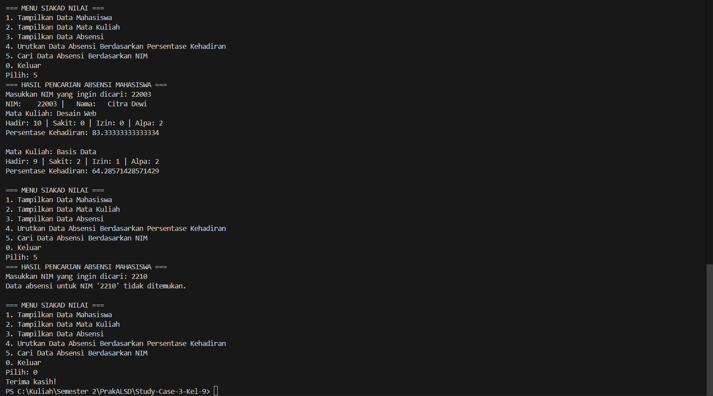

|  | Algorithm and Data Structure |
|--|--|
| NIM |  244107020107 , 244107020018 , 244107020212|
| Nama |  Helmi Rizqi Ramadhan , Muhammad Fattahul Alim , Naufal Abid Aurizky |
| Kelas | TI - 1H |
| Repository | [link] (https://github.com/FattahulAlim/Study-Case-3-Kel-9) |

# Jobsheet 7 - Siakad Nilai CASE METHOD 3

## Hasil Studi Kasus 3 - Kelompok 9

